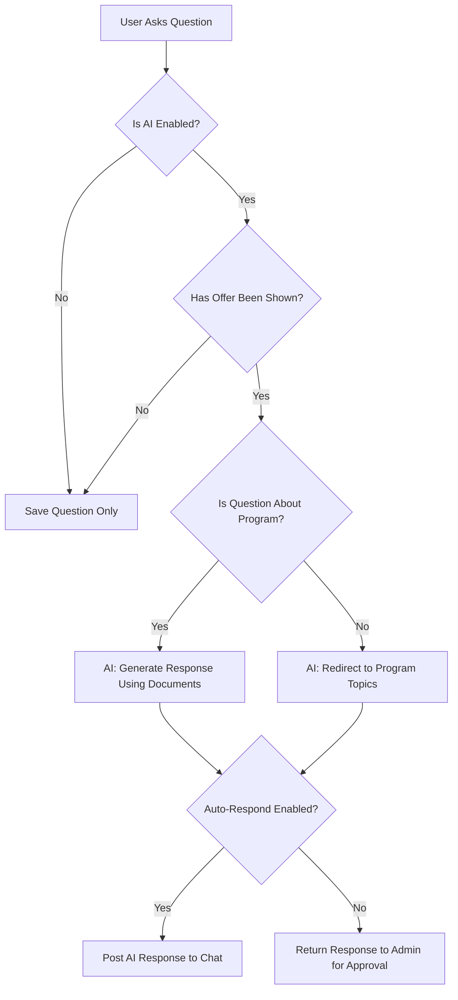

# AI Chat Assistant - Smart Post-CTA Question Answering

## 🤖 Overview

The AI Chat Assistant automatically answers attendee questions **ONLY AFTER the offer/CTA is shown** during the webinar. It uses GPT-4o-mini with your program documents to provide intelligent, context-aware responses about your program.

---

## ✨ Key Features

### 1. **Smart Activation**
- ✅ AI is **OFF** before CTA/offer appears
- ✅ AI **activates automatically** when first offer timestamp is reached
- ✅ Only answers program-related questions
- ✅ Ignores off-topic questions

### 2. **Knowledge Base**
- Upload unlimited program documents
- Categories: Overview, Pricing, FAQ, Curriculum, Testimonials
- AI uses these documents to answer questions accurately
- Never makes up information

### 3. **Customizable Behavior**
- Set custom system prompts
- Adjust AI temperature (creativity vs accuracy)
- Control max response length
- Enable/disable auto-responses
- Require approval before sending

---

## 🗄️ Database Schema

### `ProgramDocument` Table
Stores knowledge base documents for AI:

```prisma
model ProgramDocument {
  id          String   @id @default(cuid())
  webinarId   String
  webinar     Webinar  @relation(fields: [webinarId], references: [id], onDelete: Cascade)
  
  title       String   // e.g., "Program Overview", "Pricing", "FAQs"
  content     String   @db.Text // The actual content AI will use
  category    String   @default("general") // "overview", "pricing", "faq", "curriculum", "testimonials"
  isActive    Boolean  @default(true)
  sortOrder   Int      @default(0)
  
  createdAt   DateTime @default(now())
  updatedAt   DateTime @updatedAt
}
```

### `AIChatConfig` Table
Configuration for AI behavior per webinar:

```prisma
model AIChatConfig {
  id          String   @id @default(cuid())
  webinarId   String   @unique
  webinar     Webinar  @relation(fields: [webinarId], references: [id], onDelete: Cascade)
  
  enabled     Boolean  @default(true)
  activateAfterOffer Boolean @default(true) // Only respond after CTA/offer is shown
  
  systemPrompt String? @db.Text // Custom instructions for AI
  temperature  Float   @default(0.7) // OpenAI temperature (0-1)
  maxTokens    Int     @default(500) // Max response length
  
  // Response behavior
  autoRespond  Boolean @default(true) // Automatically respond to questions
  requireApproval Boolean @default(false) // Require host approval before sending
  
  createdAt   DateTime @default(now())
  updatedAt   DateTime @updatedAt
}
```

---

## 🔌 API Endpoints

### 1. Get AI Response
```
POST /api/chat/ai-response
```

**Request Body:**
```json
{
  "webinarId": "abc123",
  "question": "What's included in the program?",
  "currentVideoTime": 1850,
  "registrationId": "reg_xyz"
}
```

**Response (Before CTA):**
```json
{
  "shouldRespond": false,
  "message": "AI is not active yet. Will activate after the offer is shown."
}
```

**Response (After CTA):**
```json
{
  "shouldRespond": true,
  "response": "The program includes 8 modules covering...",
  "autoSent": true,
  "requiresApproval": false
}
```

### 2. Get/Update AI Configuration
```
GET  /api/webinars/[id]/ai-config
POST /api/webinars/[id]/ai-config
```

**POST Request Body:**
```json
{
  "enabled": true,
  "activateAfterOffer": true,
  "systemPrompt": "You are a helpful assistant for...",
  "temperature": 0.7,
  "maxTokens": 500,
  "autoRespond": true,
  "requireApproval": false
}
```

### 3. Manage Program Documents
```
GET    /api/webinars/[id]/program-documents
POST   /api/webinars/[id]/program-documents
PATCH  /api/webinars/[id]/program-documents
DELETE /api/webinars/[id]/program-documents?documentId=doc_123
```

**POST Request Body:**
```json
{
  "title": "Program Overview",
  "content": "Our program teaches...",
  "category": "overview",
  "isActive": true,
  "sortOrder": 0
}
```

---

## 🎯 How It Works

### Step 1: Upload Program Documents (Admin)
```typescript
const documents = [
  {
    title: "Program Overview",
    category: "overview",
    content: `
      Our Islamic Parenting Mastery Program includes:
      - 8 comprehensive modules
      - Weekly live Q&A sessions
      - Private community access
      - Lifetime access to materials
      - Certificate of completion
    `
  },
  {
    title: "Pricing & Payment Plans",
    category: "pricing",
    content: `
      Full Program: $497
      Payment Plan: 3 payments of $177
      
      Special Launch Offer: $297 (Limited time)
      
      30-day money-back guarantee included.
    `
  },
  {
    title: "Common Questions",
    category: "faq",
    content: `
      Q: How long is the program?
      A: The program is 8 weeks long, with 1 module per week.
      
      Q: Is there a community?
      A: Yes! Private Facebook group with 24/7 access.
      
      Q: What if I miss a week?
      A: All modules are recorded and available lifetime.
    `
  }
];

// Upload each document
for (const doc of documents) {
  await fetch(`/api/webinars/${webinarId}/program-documents`, {
    method: 'POST',
    headers: { 'Content-Type': 'application/json' },
    body: JSON.stringify(doc)
  });
}
```

### Step 2: Configure AI Settings (Admin)
```typescript
await fetch(`/api/webinars/${webinarId}/ai-config`, {
  method: 'POST',
  headers: { 'Content-Type': 'application/json' },
  body: JSON.stringify({
    enabled: true,
    activateAfterOffer: true, // KEY: Only after CTA
    systemPrompt: `
      You are a helpful assistant for the Islamic Parenting Mastery Program.
      
      Answer questions about the program, pricing, curriculum, and logistics.
      Be warm, professional, and encouraging.
      If someone asks off-topic questions, politely redirect them.
      Never make up information - only use what's in the program documents.
    `,
    temperature: 0.7,
    maxTokens: 500,
    autoRespond: true,
    requireApproval: false
  })
});
```

### Step 3: Attendee Asks Question (Frontend)
```typescript
// In webinar live room, when user sends a chat message
async function handleSendMessage(message: string) {
  // First, check if we should get AI response
  const currentTime = getCurrentVideoTime(); // e.g., 1850 seconds
  
  const aiResponse = await fetch('/api/chat/ai-response', {
    method: 'POST',
    headers: { 'Content-Type': 'application/json' },
    body: JSON.stringify({
      webinarId,
      question: message,
      currentVideoTime: currentTime,
      registrationId
    })
  }).then(r => r.json());
  
  if (aiResponse.shouldRespond) {
    // AI generated a response!
    console.log('AI Response:', aiResponse.response);
    
    if (aiResponse.autoSent) {
      // Response was automatically sent to chat
      console.log('AI response was automatically posted to chat');
    }
  } else {
    // AI not active yet (before CTA)
    console.log('AI will activate after the offer is shown');
  }
  
  // Save user's message to chat
  await fetch('/api/chat', {
    method: 'POST',
    headers: { 'Content-Type': 'application/json' },
    body: JSON.stringify({
      webinarId,
      message,
      registrationId
    })
  });
}
```

---

## 🧠 AI Logic Flow



---

## 📝 Example Conversation

### Before CTA (30 mins into webinar):
**Attendee:** "What's included in the program?"  
**AI:** *[Silent - no response]*  
**Status:** Question saved to database, AI will respond after CTA

### After CTA (32 mins - offer shown at 31 mins):
**Attendee:** "What's included in the program?"  
**AI (Program Assistant):** "Great question! The Islamic Parenting Mastery Program includes 8 comprehensive modules covering Islamic character building, discipline with love, teaching prayer, Quran connection, and much more. You'll also get weekly live Q&A sessions, access to our private community, lifetime access to all materials, and a certificate of completion. Is there a specific aspect you'd like to know more about?"

**Attendee:** "How much does it cost?"  
**AI (Program Assistant):** "The full program is normally $497, but we have a special launch offer of just $297 (limited time). We also offer a payment plan of 3 payments of $177 if that works better for you. All purchases include our 30-day money-back guarantee, so there's no risk to try it out!"

**Attendee:** "What's the weather like tomorrow?"  
**AI (Program Assistant):** "I'm here to help you with questions about the Islamic Parenting Mastery Program. Is there anything about the program, curriculum, pricing, or how to join that I can help you with?"

---

## ⚙️ Configuration Options

### Temperature (0.0 - 1.0)
- **0.0-0.3**: Very factual, stick to documents (recommended for pricing/facts)
- **0.4-0.7**: Balanced creativity and accuracy (default: 0.7)
- **0.8-1.0**: More creative, less predictable (not recommended for sales)

### Max Tokens (100 - 1000)
- **100-300**: Short, concise answers
- **400-600**: Medium length (default: 500)
- **700-1000**: Detailed, comprehensive answers

### Auto-Respond
- **true**: AI posts response immediately to chat (recommended)
- **false**: Response returned to admin for manual posting

### Require Approval
- **true**: Admin must approve before AI response is sent
- **false**: Responses sent automatically (recommended)

---

## 🔒 Safety Features

### 1. Topic Filtering
AI is instructed to ONLY answer program-related questions:
- Program content/curriculum
- Pricing and payment plans
- Logistics (duration, schedule, access)
- Benefits and outcomes
- Technical questions (platform, replays, etc.)

Off-topic questions get a polite redirect.

### 2. Fact-Checking
AI is instructed to:
- Never make up information
- Only use provided documents
- Say "I don't have that information" when unsure
- Suggest contacting support for complex issues

### 3. Manual Override
Admins can:
- Disable AI at any time
- Delete AI responses from chat
- Hide responses before they appear
- Update documents in real-time

---

## 🎨 Admin UI (To Build)

### Location
`/dashboard/webinars/[id]/ai-assistant`

### Sections

#### 1. AI Configuration Card
- Toggle: Enable/Disable AI
- Toggle: Activate After Offer Only
- Slider: Temperature (0-1)
- Input: Max Tokens
- Textarea: Custom System Prompt
- Toggle: Auto-Respond
- Toggle: Require Approval

#### 2. Program Documents List
- Table with columns: Title, Category, Status, Actions
- Add Document button
- Edit/Delete actions
- Drag to reorder

#### 3. Document Editor Modal
- Input: Title
- Dropdown: Category
- Textarea: Content (large, with preview)
- Toggle: Active
- Number: Sort Order
- Save/Cancel buttons

#### 4. Live AI Activity (Real-time)
- Shows recent AI responses
- Approve/Reject buttons (if approval required)
- Hide response button
- Regenerate response button

---

## 🚀 Quick Start

### 1. Enable AI for a Webinar
```bash
curl -X POST http://localhost:3000/api/webinars/[webinar-id]/ai-config \
  -H "Content-Type: application/json" \
  -d '{
    "enabled": true,
    "activateAfterOffer": true
  }'
```

### 2. Add Program Documents
```bash
curl -X POST http://localhost:3000/api/webinars/[webinar-id]/program-documents \
  -H "Content-Type: application/json" \
  -d '{
    "title": "Program Overview",
    "content": "Your program details here...",
    "category": "overview"
  }'
```

### 3. Test AI Response
```bash
curl -X POST http://localhost:3000/api/chat/ai-response \
  -H "Content-Type: application/json" \
  -d '{
    "webinarId": "[webinar-id]",
    "question": "What is included in the program?",
    "currentVideoTime": 1900
  }'
```

---

## 📊 Benefits

### For You (Host)
✅ Save time answering repetitive questions  
✅ Qualify leads automatically  
✅ Maintain engagement during Q&A  
✅ Handle large audiences easily  
✅ Focus on closing, not answering FAQs

### For Attendees
✅ Instant answers to questions  
✅ No waiting for host response  
✅ 24/7 availability (for replays)  
✅ Consistent, accurate information  
✅ Better decision-making

---

## 🐛 Troubleshooting

### AI Not Responding?
1. Check if AI is enabled in config
2. Verify offer timestamp has been reached
3. Check OpenAI API key is set in `.env`
4. Review program documents exist and are active
5. Check console logs for errors

### Responses Not Accurate?
1. Update program documents with more details
2. Adjust temperature lower (0.4-0.5)
3. Add specific FAQs to documents
4. Review and refine system prompt

### AI Responding to Off-Topic Questions?
1. Update system prompt to be more strict
2. Add examples of off-topic questions to prompt
3. Lower temperature to 0.3-0.4
4. Review AI responses and iterate

---

## 🔮 Future Enhancements

- [ ] Multi-language support (auto-detect language)
- [ ] Voice input for questions
- [ ] Suggested questions (prompt attendees)
- [ ] AI analytics (most asked questions)
- [ ] A/B test different prompts
- [ ] Integration with CRM (tag interested buyers)
- [ ] Sentiment analysis (detect frustrated attendees)
- [ ] Auto-escalation (alert host for complex questions)

---

## 📚 Related Documentation

- [Chat System](./CHAT_QUICK_START.md)
- [Offer Management](./OFFER_MANAGEMENT.md)
- [Webinar Live Room](./LIVE_ROOM_UPDATE_COMPLETE.md)
- [Analytics](./ATTENDEE_ANALYTICS_COMPLETE.md)

---

**Status**: ✅ Backend Complete, UI Pending  
**Last Updated**: November 12, 2025  
**OpenAI Model**: GPT-4o-mini
